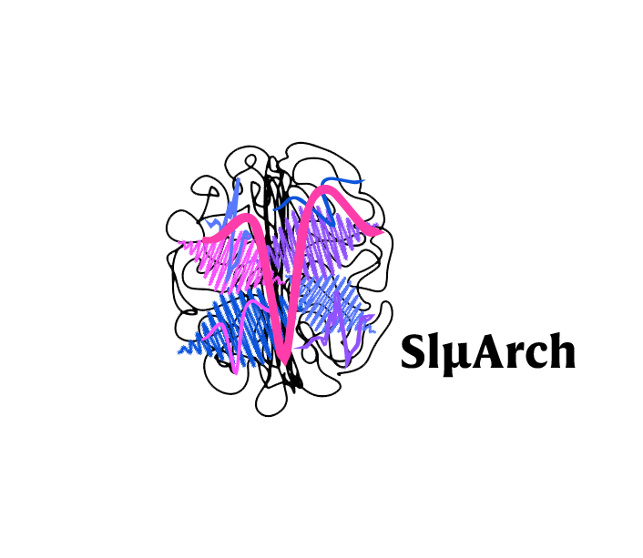

# SlµArch



[](https://pypi.python.org/pypi/SluArch)
[](https://anaconda.org/conda-forge/SluArch)
[](https://pypi.python.org/pypi/SluArch)
[](https://github.com/sjg2203/SluArch/blob/main/LICENSE)
[](https://github.com/PyCQA/bandit)
[](https://pypi.python.org/pypi/SlµArch)
[](http://hits.dwyl.com/sjg2203/SluArch)
[](https://github.com/astral-sh/ruff)

[SlµArch](https://github.com/sjg2203/SluArch) (Sleep MicroArchitecture): a Python package to analyse sleep microarchitecture.

The toolbox is optimised for Python 3.10 and above and was tested on both Windows and macOS ARM.

> [!NOTE]
> All dependencies are listed in [requirements](docs/requirements.txt), Python 3.10 minimum.

## Citation [](https://doi.org/10.5281/zenodo.10651391)

If you use this package, please cite as follows:

- Guillot,
  S.J.<a id="cy-effective-orcid-url" class="underline" href="https://orcid.org/0000-0002-1623-7091" target="orcid.widget" rel="me noopener noreferrer" style="vertical-align: top"></a> (
  2024). SlµArch (2024.05.15). GitHub, Zenodo. https://doi.org/10.5281/zenodo.10651391

## Contribution [](https://github.com/sjg2203/SluArch/issues)

This package were created and maintained by SJG.

Contributions are welcome, so feel free to submit a [pull request](https://github.com/sjg2203/SluArch/pulls)!

To report a bug, please open a new [issue](https://github.com/sjg2203/SluArch/issues).

Note that this program is provided with NO WARRANTY OF ANY KIND under Apache 2.0 [license](LICENSE).

## Installation of Python package

To install the toolbox, use:

- Using
  conda [](https://anaconda.org/conda-forge/SluArch)

```python
conda install -c cf-staging sluarch
```

- Using
  pip [](https://github.com/sjg2203/SluArch/actions/workflows/pypi_publish.yml) [](https://pypi.python.org/pypi/SluArch)

```python
pip install sluarch
```
